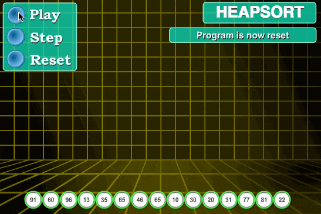

# 堆排序

## 相关知识

堆是一个近似完全二叉树的结构，并同时满足堆积的性质：即子结点的值总是小于或者大于它的父结点。堆排序可以说是一种利用堆的概念来排序的选择排序。分两种方法：

1. 大顶堆：根结点为最大值，每个结点的值大于或等于子结点的值；在堆排序算法中用于升序排列。
2. 小顶堆：根结点为最小值，每个结点的值小于或等于子结点的值；在堆排序算法中用于降序排列。

堆排序的平均时间复杂度为 O(nlogn)

## 算法步骤

1. 创建一个堆 H[0...n-1]；
2. 把堆首（最大值）和堆尾互换；
3. 把堆的尺寸缩小 1，并调用堆调整函数，目的是把新的数组顶端数据调整到相应位置；
4. 重复步骤 2，直到堆的尺寸为 1

## 算法图片



## 算法分析

最佳情况：T(n) = O(nlogn)
最差情况：T(n) = O(nlogn)
平均情况：T(n) = O(nlogn)

## 代码实现

```javascript
// 堆排序

// 交换数据
function swap(arr, i, j) {
  [arr[i], arr[j]] = [arr[j], arr[i]];
}

/*
  description：堆调整
  @param arr 排好序数组
  @param i 数组下标
  @param len 堆大小
*/
function heapify(arr, i, len) {
  let left = i * 2 + 1;
  let right = i * 2 + 2;
  let max = i;
  if (left < len && arr[left] > arr[max]) {
    max = left;
  }
  if (right < len && arr[right] > arr[max]) {
    max = right;
  }
  if (max !== i) {
    swap(arr, i, max);
    heapify(arr, max, len);
  }
}

/*
  description：堆排序
  @param  arr 待排序数组
  @return arr 排好序数组
*/
function heapSort(arr) {
  // 建大顶堆
  let len = arr.length;
  for (let i = Math.floor(len / 2) - 1; i >= 0; i--) {
    heapify(arr, i, len);
  }

  // 堆排序
  for (let j = len - 1; j > 0; j--) {
    swap(arr, 0, j);
    len--;
    heapify(arr, 0, len);
  }
  return arr;
}

const list = [91, 60, 96, 13, 35, 65, 46, 65, 10, 30, 20, 31, 77, 81, 22];
const result = heapSort(list);
console.log(result);
```

[参考链接](https://www.2cto.com/kf/201609/548586.html)
[参考链接](https://www.runoob.com/w3cnote/heap-sort.html)
