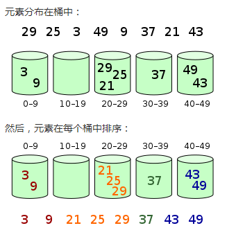

# 桶排序

## 相关知识

桶排序的工作原理：假设输入数据服从均匀分布，将数据分到有限数量的桶里，每个桶再分别排序。为了使桶排序更加高效，我们需要做到这两点：

1. 在额外空间充足的情况下，尽量增大桶的数量；
2. 使用的映射函数能够将输入的 N 个数据均匀的分配到 K 个桶中。
   同时，对于桶中元素排序，选择哪种比较排序算法对于性能影响至关重要

## 算法图片



## 算法步骤

1. 设置一个定量的数组当做空桶；
2. 遍历输入数据，并且把数据一个一个放到对应的桶里去；
3. 对每个不是空的桶进行排序；
4. 从桶里把排序好的数据拼接起来

## 算法分析

最佳情况：T(n) = O(n+k)
最差情况：T(n) = O(n+k)
平均情况：T(n) = O(n+k)

## 代码实现

```javascript
/*
  @param：arr 待排序数组
  @param：num 桶数量
  @return arr 排序好的数组
*/
function bucketSort(arr, num) {
  // 判断数组长度
  const len = arr.length;
  if (len < 2) {
    return arr;
  }
  // 求最大最小值
  let min = arr[0];
  let max = arr[0];
  for (let i = 0; i < len; i++) {
    const temp = arr[i];
    min = temp < min ? temp : min;
    max = temp > max ? temp : max;
  }
  // 桶数量设置默认值
  num = num || 5;
  // 求一个桶的取值范围
  const range = (max - min + 1) / num;
  // 求数据对应的编号
  // 对每个桶填充数据，并且桶里的数据进行排序
  const buckets = [];
  for (let j = 0; j < len; j++) {
    const temp = arr[j];
    const index = Math.floor((temp - min) / range);
    if (buckets[index]) {
      const list = buckets[index];
      let k = list.length - 1;
      while (k >= 0 && list[k] > temp) {
        list[k + 1] = list[k];
        k -= 1;
      }
      list[k + 1] = temp;
    } else {
      buckets[index] = [temp];
    }
  }
  // 拼接每个桶的数据
  let result = [];
  for (let n = 0; n < num; n++) {
    result = [...result, ...buckets[n]];
  }
  return result;
}

var arr = [3, 44, 38, 5, 47, 15, 36, 26, 27, 2, 46, 4, 19, 50, 48];
console.log(bucketSort(arr, 6)); //[2, 3, 4, 5, 15, 19, 26, 27, 36, 38, 44, 46, 47, 48, 50]
```

[参考链接](https://www.2cto.com/kf/201609/548586.html)
[参考链接](https://www.runoob.com/w3cnote/bucket-sort.html)
[参考链接](https://www.jb51.net/article/175002.htm)
